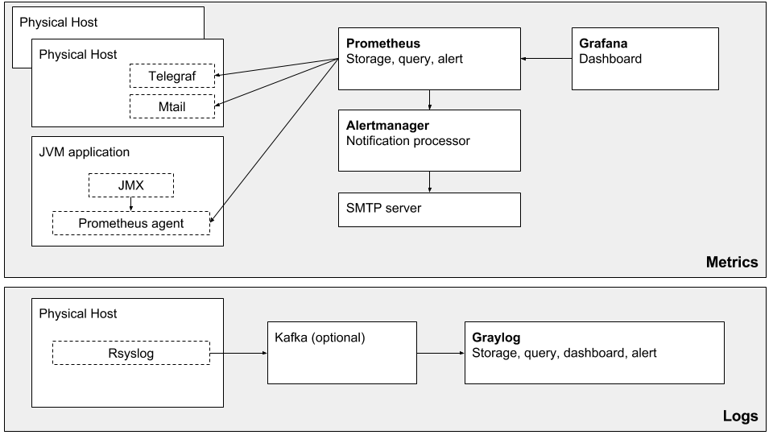

# Monitoring microservice

An opinionated monitoring stack for physical hosts, clusters and microservices applications

## Background

Test and learn how to monitor distributed microservices architecture

## Logs OR Metrics OR both

Logs and metrics are totally different type of data. Metrics are numeric values. Logs are string (normally long string) and use much more bytes, this means more bandwidth, storage, and cpu used of transfer them. For example, 10 servers logging 1KB for each of 1000 requests per second will fill most of a 100 Mbit.[1]

Metrics has another important quality: they are more stable in source code then logs [2]. A single metric is linked to one function: expose a value for an event, indeed it is less subject to changes in next software releases.
On the other side logs have different scope: gives feedbacks to developer of what happened and (eventually) trigger notification rules. It becomes hard to keep this two scopes aligned and there is a concrete risk to have a log monitoring system not working as expected.

In this stack metrics are first class data to focus on and logs are used to deeply investigate problems.

## Stack overview

## Metrics stack

[Metrics stack](./metrics) is based on:

- [Grafana](https://grafana.com/) to query and display metrics 
- [Prometheus](http://prometheus.io) to poll, store and query metrics
- [Alertmanager](https://prometheus.io/docs/alerting/alertmanager/) to send notifications
- [Telegraf](https://docs.influxdata.com/telegraf) to expose physical host metrics in http prometheus format
- [Mtail](https://github.com/google/mtail) to parse log files and expose prometheus metrics

**[See detailed how to in metrics folder](./metrics)**

## Logs stack

[Logs stack](./logs) is based on:

- [Rsyslog](http://www.rsyslog.com/) to send data to graylog
- [Graylog](http://www.graylog.org) to store, query, visualize logs

**[See detailed how to in logs folder](./logs)**

## Further reading

- [1] <https://grafana.com/blog/2016/01/05/logs-and-metrics-and-graphs-oh-my>
- [2] <1.	http://sail.cs.queensu.ca/Downloads/EMSE2017_ExaminingTheStabilityOfLoggingStatements.pdf
>

